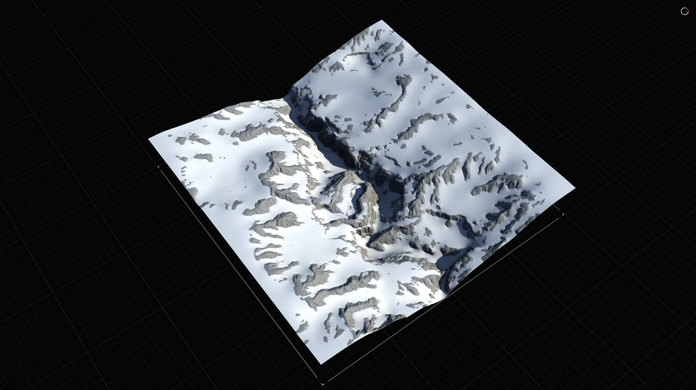
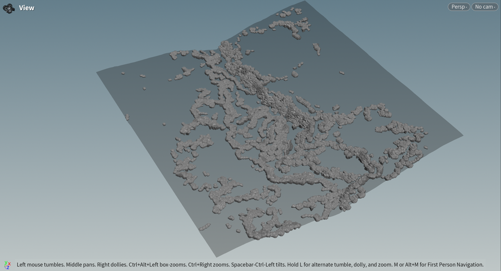
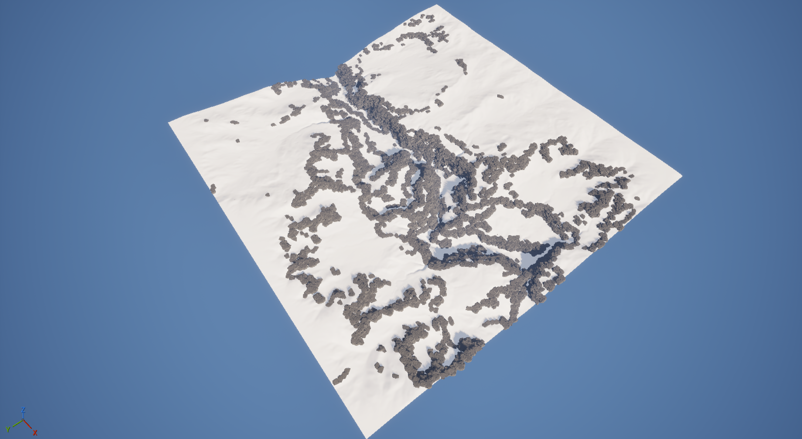

# Yichen Yang
**技术美术 (Technical Artist) | 专注于程序化生成 (PCG)**

你好！欢迎来到我的作品集。我致力于探索 Houdini、UE5 和 Python 在游戏开发中的程序化解决方案。

---

## 项目与作品

### 项目一：Houdini 程序化岩石包边 (Gaea/Houdini/UE5)

  <iframe 
    src="https://player.bilibili.com/player.html?bvid=BV1tmeRzBEWd&page=1" 
    scrolling="no" 
    border="0" 
    frameborder="no" 
    framespacing="0" 
    allowfullscreen="true"
    style="position: absolute; top: 0; left: 0; width: 100%; height: 100%;">
  </iframe>

  <strong>项目简介：</strong> [Gaea: 负责生成基础地形地貌，并输出岩石区域遮罩（Mask）。Houdini:利用 Gaea 遮罩，程序化撒点并放置大型主体岩石。通过 Python 脚本实现精细化控制，根据已有岩石位置和遮罩数据，自动生成（或放置）用于过渡和填充的细节岩石。UE5: 导入所有资产，并利用遮罩在材质中实现岩石与地形的自动包边和无缝融合。]
   
  <a href="https://www.bilibili.com/video/BV1tmeRzBEWd/" target="_blank">
    在 Bilibili 上观看 (获取弹幕和评论)
  </a>

  
  

    <strong>点击展开/折叠项目效果图片 (共 3 张)</strong>
  

  

    
    
    
  

* **使用技术：** Gaea, Houdini, VEX, UE5 (材质)

---

### 项目二：Houdini Python 程序化建筑

  <strong>项目简介：</strong> [本项目是一个基于 Houdini 和 Python 构建的程序化建筑生成器。其核心思想是将‘乐高积木’（模块化组件）与多阶段算法相结合：
体素化 (Voxelization): 首先，将任意输入几何体（或建筑轮廓）体素化，将其转换为一个三维空间网格，作为建筑的“地基”和可建造空间。
内部流线 (A Pathfinding):* 接着，利用带约束的 A* 寻路算法，在体素空间中自动“雕刻”出核心的内部流线，如走廊和楼梯间。
模块填充 (Template Matching): 最后，系统使用模板匹配算法，将一个预设的“乐高”模块库（如房间、拐角、T型路口等）智能地拼装到 A* 算法生成的路径和剩余空间中，最终组装成完整的建筑结构。]
   
  <strong>使用技术：</strong> Houdini, Python (Houdini), Jupyter Notebook
   

  
  

    <strong>点击展开/折叠项目效果图片 (共 9 张)</strong>
  

  

    
    
    
    
    
    
    
    
    
  

---

### 项目三：[你的下一个项目，例如：UE5 实时雪迹效果]

* **项目简介：** [例如：使用 UE5 的 Render Target 和材质蓝图实现的实时交互式雪地脚印效果。]
* **使用技术：** UE5 (Material Blueprint, Render Target), HLSL
* **项目详情/视频链接：** [链接...]

---

## 关于我

[在这里写一段 2-3 句话的个人简介，突出你对 PCG 的热情、你的核心能力和职业目标。例如：我热衷于在游戏和实时渲染中创建复杂的程序化系统，擅长使用 Houdini 和 UE5 构建高效、可控的工具流来解决美术管线中的挑战。]

* **核心技能：**
    * **DCC:** Houdini (VEX, Python), UE5 (Blueprints, Materials)
    * **编程:** Python, C++, HLSL
    * **其他:** Substance Designer, ZBrush, ...
* **联系方式：**
    * **Email:** [yichen.yang.works@email.com (请替换为你的邮箱)]
    * **LinkedIn:** [linkedin.com/in/your-profile (请替换为你的领英链接)]
    * **ArtStation:** [artstation.com/your-profile (请替换为你的A站链接)]
