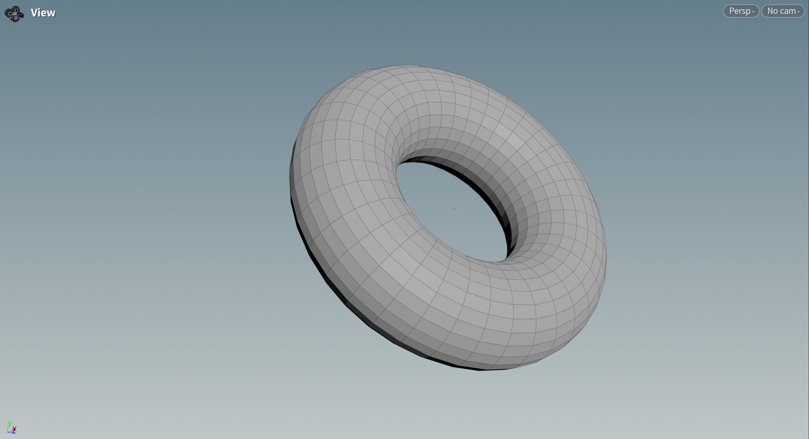
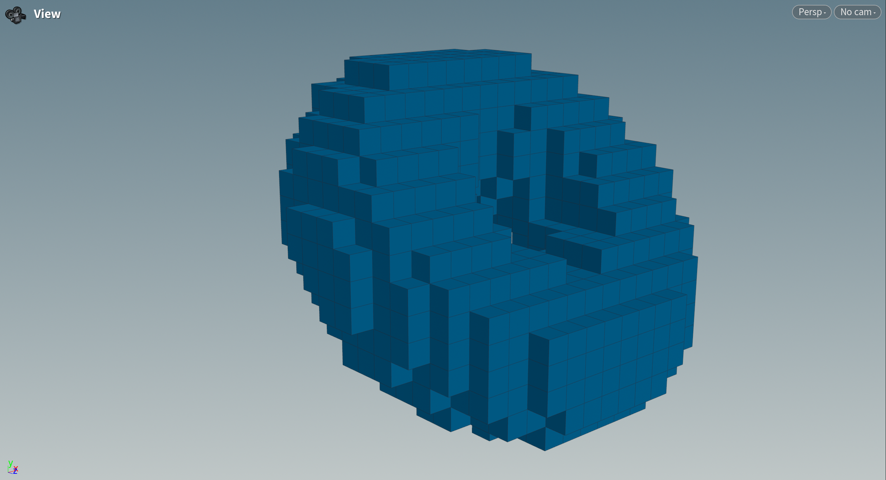
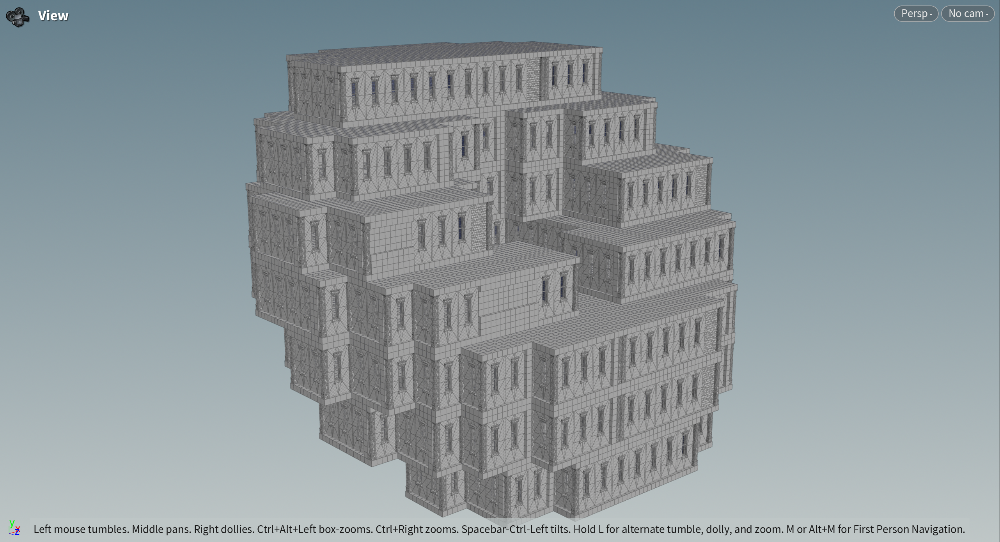
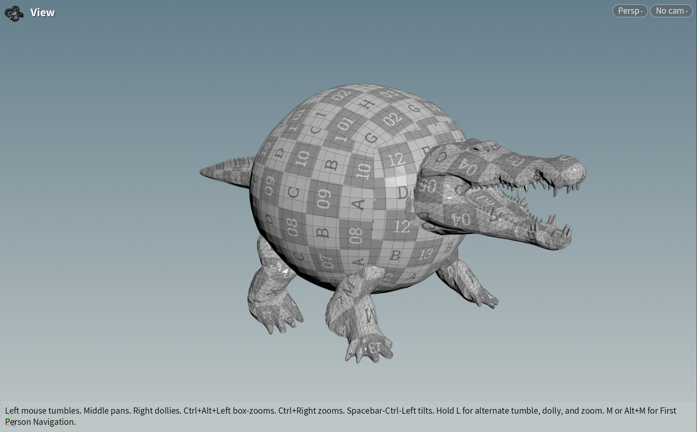
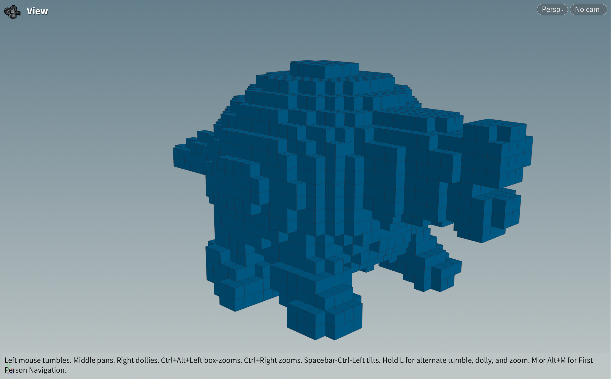
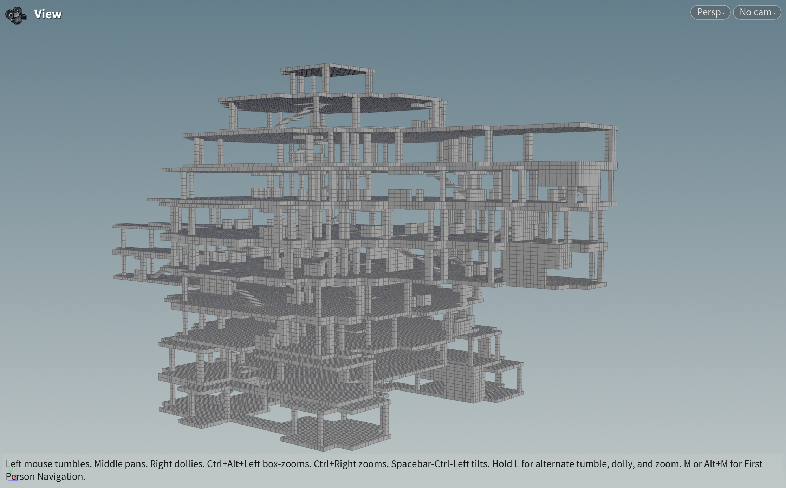
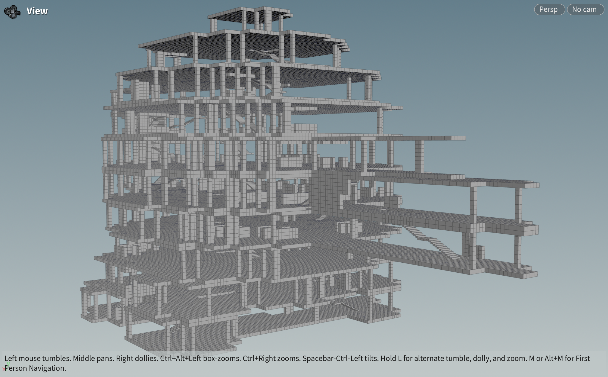
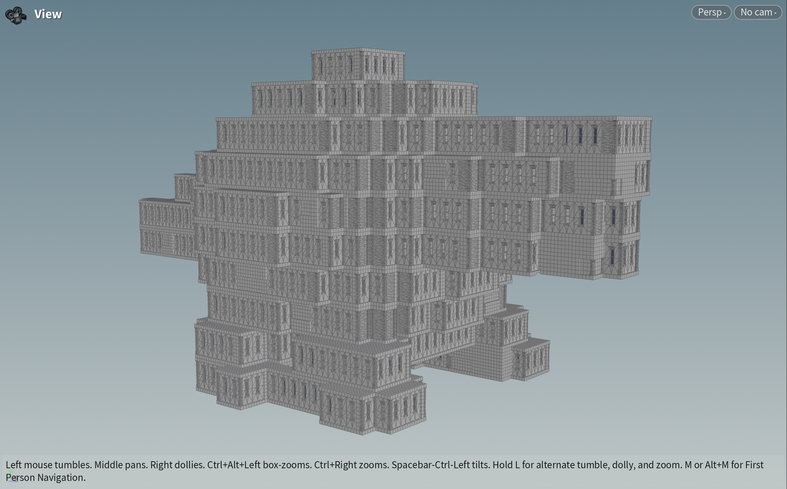
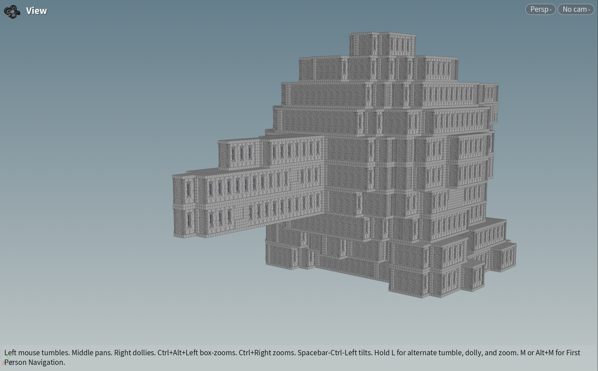

# 你的名字（或昵称）
**技术美术 (Technical Artist) | 专注于程序化生成 (PCG)**

你好！欢迎来到我的作品集。我致力于探索 Houdini、UE5 和 Python 在游戏开发中的程序化解决方案。

---

## 项目与作品

### 项目一：[Houdini 程序化程序化岩石包边]

* **项目简介：** [这里写项目描述，比如：一个使用 L-System 和 VEX 在 Houdini 中生成藤蔓的工具，并能一键导入 UE5。]
* **使用技术：** Houdini, VEX, Python, UE5
* **项目详情/视频链接：** [（可选）放一个 Bilibili、YouTube 或 ArtStation 的链接]

### 项目二：[Houdini Python 程序化建筑]

* **项目简介：** [项目描述，比如：使用 UE5 的材质蓝图和 Render Target 实现的实时交互式雪地脚印效果。]
* **使用技术：** UE5 (Material Blueprint, Render Target), HLSL
* **项目详情/视频链接：** [链接...]

<table>
  <tr>
    <td></td>
    <td></td>
    <td></td>
  </tr>
  <tr>
    <td></td>
    <td></td>
    <td></td>
    <td></td>
    <td></td>
    <td></td>
  </tr>
</table>

### 项目三：[项目标题三]

* **项目简介：** [...]
* **使用技术：** [...]

---

## 关于我

[简单介绍一下你自己的背景、技能点和热情所在。]

* **核心技能：**
    * **DCC:** Houdini (VEX, Python), UE5 (Blueprints, Materials)
    * **编程:** Python, C++, HLSL
    * **其他:** Substance Designer, ZBrush, ...
* **联系方式：**
    * **Email:** [你的邮箱@example.com]
    * **LinkedIn:** [你的 LinkedIn 链接（可选）]
    * **ArtStation:** [你的 ArtStation 链接（可选）]
